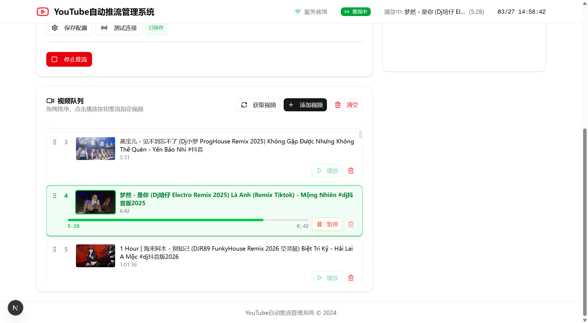
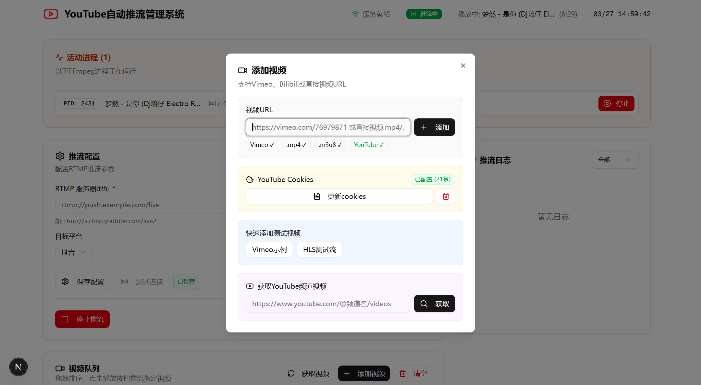

# YouTube 自动推流管理系统

一个功能强大的 YouTube 视频自动推流管理系统，支持视频队列管理、频道视频批量获取、RTMP 推流等功能。

## ✨ 功能特点

- 🎬 **视频队列管理** - 支持拖拽排序、批量添加、实时进度显示
- 📺 **多平台支持** - YouTube、Vimeo、Bilibili、直接视频URL
- 🔄 **自动推流** - 使用 FFmpeg 进行 RTMP 推流到各大直播平台
- 🍪 **Cookies 支持** - 支持 YouTube cookies 认证，绕过访问限制
- 📊 **实时监控** - 进程状态、推流日志实时显示
- 📡 **频道视频获取** - 一键获取 YouTube 频道所有视频，批量添加到队列
- 🎨 **现代UI** - 基于 shadcn/ui 的现代化响应式界面

## 📸 界面预览

### 主界面


### 频道视频获取


## 🛠 技术栈

- **前端框架**: Next.js 16 + React + TypeScript
- **UI组件**: shadcn/ui + Tailwind CSS + Lucide Icons
- **数据库**: Prisma ORM + SQLite
- **视频处理**: yt-dlp + FFmpeg
- **拖拽排序**: @dnd-kit

## 🚀 快速开始

### 1. 安装依赖

```bash
bun install
```

### 2. 初始化数据库

```bash
bun run db:push
```

### 3. 配置环境变量

创建 `.env` 文件：

```env
DATABASE_URL="file:./db/custom.db"
```

### 4. 启动开发服务器

```bash
bun run dev
```

## 📖 使用指南

### 配置 YouTube Cookies

YouTube 视频需要 cookies 才能解析：

1. 在 Chrome/Firefox 浏览器登录 YouTube 账号
2. 安装 cookies 导出扩展：
   - Chrome: [Get cookies.txt LOCALLY](https://chromewebstore.google.com/detail/get-cookiestxt-locally/cclelndahbckbenkjhflpdbgdldlbecc)
   - Firefox: [cookies.txt](https://addons.mozilla.org/en-US/firefox/addon/cookies-txt/)
3. 访问 YouTube 视频页面
4. 点击扩展图标，导出 cookies.txt
5. 在系统中上传 cookies.txt 文件

### 获取频道视频

1. 点击"添加视频"按钮
2. 在"获取YouTube频道视频"区域输入频道URL，例如：
   ```
   https://www.youtube.com/@bitmusic.official/videos
   ```
3. 点击"获取"按钮
4. 在弹出的窗口中选择要添加的视频
5. 点击"添加选中"将视频添加到队列

### 推流配置

1. 配置 RTMP 服务器地址和推流密钥
2. 添加视频到队列
3. 点击播放按钮开始推流

### 推流命令示例

```bash
ffmpeg -re -i "视频URL" -c:v copy -c:a copy -f flv "rtmp://服务器地址/密钥"
```

## 📁 目录结构

```
├── public/               # 静态资源
├── src/
│   ├── app/              # Next.js App Router
│   │   ├── api/          # API 路由
│   │   │   ├── videos/   # 视频相关API
│   │   │   ├── stream/   # 推流相关API
│   │   │   └── ...
│   │   └── page.tsx      # 主页面
│   ├── components/       # React 组件
│   │   └── ui/           # UI基础组件
│   └── lib/              # 工具函数
├── prisma/               # 数据库 Schema
├── cookies/              # YouTube Cookies 存储
└── db/                   # SQLite 数据库文件
```

## 🔌 API 接口

| 接口 | 方法 | 描述 |
|------|------|------|
| `/api/videos` | GET/POST/PUT/DELETE | 视频管理 |
| `/api/videos/youtube` | GET/POST/PUT/DELETE | YouTube 解析 & Cookies 管理 |
| `/api/videos/fetch-channel` | POST | 获取频道视频列表 |
| `/api/videos/batch` | POST | 批量添加视频 |
| `/api/stream/force-switch` | POST | 强制切换视频 |
| `/api/stream/stop` | POST | 停止推流 |
| `/api/stream/processes` | GET | 获取进程状态 |
| `/api/stream-configs` | GET/POST | 推流配置管理 |

## 🎯 支持的平台

| 平台 | 需要Cookies | 备注 |
|------|------------|------|
| YouTube | ✅ 是 | 必须上传cookies |
| YouTube频道 | ✅ 是 | 批量获取频道视频 |
| Vimeo | ❌ 否 | 直接解析 |
| Bilibili | ❌ 否 | 直接解析 |
| 直接URL | ❌ 否 | .mp4/.m3u8等 |

## 📝 开发命令

```bash
# 开发模式
bun run dev

# 代码检查
bun run lint

# 数据库迁移
bun run db:push
```

## 📄 许可证

MIT License

## 🤝 贡献

欢迎提交 Issue 和 Pull Request！

---

**⭐ 如果这个项目对你有帮助，请给一个 Star！**
